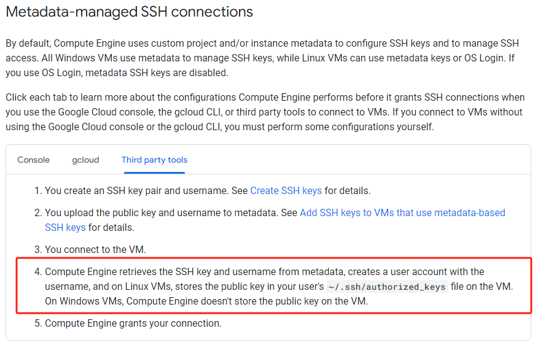

# V2ray 配置教程
## 1. 服务器配置
1. 创建密匙的时候可以用 `-C`来指定用户名，谷歌会根据对应的用户名直接创建账号
``` bash
# 之前github的创建方法也是类似的。指定了远程的github账号
# 这里指定的是远程的用户账号，没有的话谷歌会自动创建
# 这是gihthub的创建方式 ssh-keygen -t ed25519 -C "your_email@example.com"
ssh-keygen -t rsa -f <LOCATION_TO_STORE_THE_KEY> -C <userName>
```
2. 上传pubkey,公钥到这个位置`Compute Engine -> Settings -> Metadata -> SSH KEYS`之后，会自动创建对应的sudo账号

3. 这之后就可以直接用这个`userName`自动登录了

## 2. 233boy-v2ray配置
1. 脚本一键安装`bash <(wget -qO- -o- https://git.io/v2ray.sh)`
2. 配置TLS，先买域名，然后转移到cloudflare
    ``` bash
    域名：https://www.godaddy.com/
    CF: https://dash.cloudflare.com/
    ```
3. 按照233脚本配置vless+TLS
    ```
    233caddy路径：/etc/caddy/233boy
    ```
    wordpress配置
    ``` bash
    # 配置wordpress
    sudo mkdir -p /src/www

    sudo chown www-data: /src/www

    curl https://wordpress.org/latest.tar.gz | sudo -u www-data tar zx -C /src/www

    # 安装数据库
    sudo apt install php-fpm \
        ghostscript \
        libapache2-mod-php \
        mysql-server \
        php \
        php-bcmath \
        php-curl \
        php-imagick \
        php-intl \
        php-json \
        php-mbstring \
        php-mysql \
        php-xml \
        php-zip

    # 进入数据库
    mysql -u root

    # mysql语句需要分号
    CREATE DATABASE wordpress;

    CREATE USER wordpress@localhost IDENTIFIED BY '<your-password>';

    GRANT SELECT,INSERT,UPDATE,DELETE,CREATE,DROP,ALTER ON wordpress.* TO wordpress@localhost;

    FLUSH PRIVILEGES;

    quit

    sudo service mysql start

    # 数据库信息就是下面这些了
    # DB_NAME=wordpress
    # USER_NAME=wordpress
    # USER_PASSWORD=<your-password>
    ``` 

    caddy 配置。wordpree+calibre。calibre的配置可以看node.txt，记得先装qt6
    ``` bash
    # see https://233boy.com/v2ray/caddy-auto-tls
    # Set max body size for uploads
    #max_request_body_size 64MB

    # Handle /calibre/ path
    # calibre 配置
    reverse_proxy /calibre/* {
        to 127.0.0.1:8080
        header_up X-Forwarded-For {remote}
        # Disable proxy buffering
        flush_interval 0
    }

    # Redirect /calibre to /calibre/
    @calibre {
        path /calibre
    }
    rewrite @calibre /calibre/

    # wordpress配置
    root * /src/www/wordpress
    encode gzip
    file_server
    php_fastcgi unix//run/php/php-fpm.sock

    @disallowed {
        path /xmlrpc.php
        path *.sql
        path /wp-content/uploads/*.php
    }

    rewrite @disallowed '/index.php'
    ```

    ## 2. x-ui-v2ray配置
    1. 装国内或者国外版的
    ``` bash
    # x-ui（国外魔改版）
    bash <(curl -Ls https://raw.githubusercontent.com/4xmen/radepa-x-ui/master/install.sh)
    # warp
    wget -N https://gitlab.com/fscarmen/warp/-/raw/main/menu.sh && bash menu.sh d
    # 1. 设置非全局
    # 2. 安装好后选5 “5. 安装 CloudFlare Client 并设置为 Proxy 模式”，必须选这里才能配合上下面的配置文件

    ```
    2. xray（1.8.1）配置，网飞+ipv4,6二级代理分流
    ``` json
    {
    "log": {
        "loglevel": "warning",
        "access": "./access.log",
        "error": "./error.log"
            },
    "api": {
        "tag": "api",
        "services": [
        "HandlerService",
        "LoggerService",
        "StatsService"
        ]
            },
    "inbounds": [
        {
        "tag": "api",
        "listen": "127.0.0.1",
        "port": 62789,
        "protocol": "dokodemo-door",
        "settings": {
            "address": "127.0.0.1"
        }
        }
    ],
    "outbounds": [
        {
        "protocol": "freedom",
        "settings": {}
        },
        {
        "tag": "blocked",
        "protocol": "blackhole",
        "settings": {}
        },
        {
            "tag":"warp",
            "protocol":"socks",
            "settings":{
                "servers":[
                    {
                        "address":"127.0.0.1",
                        "port":40000
                    }
                ]
            }
        },
        {
            "tag":"WARP-socks5-v4",
            "protocol":"freedom",
            "settings":{
                "domainStrategy":"UseIPv4"
            },
            "proxySettings":{
                "tag":"warp"
            }
        },
        {
            "tag":"WARP-socks5-v6",
            "protocol":"freedom",
            "settings":{
                "domainStrategy":"UseIPv6"
            },
            "proxySettings":{
                "tag":"warp"
            }
        }
    ],
    "policy": {
        "levels": {
        "0": {
            "statsUserDownlink": true,
            "statsUserUplink": true
        }
        },
        "system": {
        "statsInboundDownlink": true,
        "statsInboundUplink": true
        }
    },
    "routing": {
        "rules": [
        {
            "type": "field",
            "inboundTag": [
            "api"
            ],
            "outboundTag": "api"
        },
        {
            "type": "field",
            "outboundTag": "blocked",
            "ip": [
            "geoip:private"
            ]
        },
        {
            "type": "field",
            "outboundTag": "blocked",
            "protocol": [
            "bittorrent"
            ]
        },
        {
            "type":"field",
            "domain":[
                "geosite:openai",
                "geosite:netflix",
                "ip.gs"
            ],
            "outboundTag":"WARP-socks5-v4"
        },
        {
            "type":"field",
            "domain":[
                "geosite:google",
                "p3terx.com"
            ],
            "outboundTag":"WARP-socks5-v6"
        }
        ]
    },
    "stats": {}
    }
    ```

## 参考链接
1. [caddy + wordpress](https://caddy.community/t/need-help-with-setting-up-caddy-error-while-trying-to-get-cert-from-acme/19939/2)
2. [233boy的网站](https://233boy.com/v2ray/)
3. [CloudFlare](https://dash.cloudflare.com/)
3. [搬瓦工](https://bandwagonhost.com/)
4. [calibre](https://manual.calibre-ebook.com/)
5. [warp代理](https://gitlab.com/fscarmen/warp/-/blob/main/README.md#warp-%E8%BF%90%E8%A1%8C%E8%84%9A%E6%9C%AC)
6. [奈飞小镇](https://netflixtown.com/)